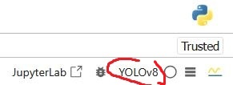

# License-Plates-Detector-Using-YOLOv8
This repository provides a step-by-step guide to train YOLOv8 from a custom set of images to detect non pre-trained objects (License plates). It is included how to create an load in Jupyter an Anaconda environment with the required versions of packages.


In the Anaconda prompt create a new environment with python 3.10

```bash
conda create -n env_name python=3.10
```

Then, activate the environment

```bash
conda activate env_name
```

Move to the root folder of the project and nstall specific versions of some packages to avoid compatibility problems by running

```bash
pip install -r requirements.txt
```

If you have a GPU compatible with CUDA install

```bash
pip install torch==2.5.1 torchvision==0.20.1 torchaudio==2.5.1 --index-url https://download.pytorch.org/whl/cu118
```

otherwise install the versions for CPU

```bash
pip install torch==2.5.1 torchvision==0.20.1 torchaudio==2.5.1
```

Then, register the Anaconda environment `env_name` as a kernel to use it in your jupyter notebook

```bash
python -m ipykernel install --user --name=env_name --display-name "Kernel_Name"
```

`--name` is the internal identifier

`--display-name` is the name you will see in jupyter

When you open the Jupyter notebook, select your kernel in the upper-right corner



The dataset used to train the model is available in Kaggle (https://www.kaggle.com/datasets/andrewmvd/car-plate-detection), it consists of 433 images with their respectives annotations in PASCAL VOC XML format. In this repository the TXT files in YOLO format (normalized coordinates) are provided. Organize the files as shown in the following tree.

```
dataset/
├── train/
│   ├── images/
│   └── labels/
├── val/
│   ├── images/
│   └── labels/
└── test/
    ├── images/
    └── labels/
```

At the end of the notebook it is included a cell in which the detector is tested in a random image of the folder dataset/test/images.

